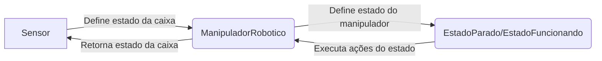

# Projeto de Manipulador Robótico

Este projeto tem como objetivo simular o funcionamento de um manipulador
robótico em dois estados: parado e funcionando. O manipulador robótico é
controlado por uma classe "FacadeManipuladorRobotico" que utiliza o padrão
Singleton e Strategy para gerenciar os estados do manipulador robótico.

## Padrões de Projeto Utilizados

### Singleton

O padrão Singleton foi utilizado na classe "ManipuladorRobotico" para
garantir que apenas uma instância do manipulador robótico seja
criada durante a execução do programa.

### Strategy
O padrão Strategy foi utilizado nas classes "EstadoParado" e "EstadoFuncionando"
para representar os dois estados do manipulador robótico. A classe
"FacadeManipuladorRobotico" utiliza esses estados para executar as ações
correspondentes ao estado atual do manipulador robótico.

### Facade
O padrão Facade foi utilizado na classe "FacadeManipuladorRobotico"
para simplificar a interação com o manipulador robótico. Ao invés
de lidar diretamente com o manipulador robótico e seus estados,
o usuário do programa pode utilizar a classe "FacadeManipuladorRobotico"
para executar as ações correspondentes ao estado atual do manipulador
robótico.

## Funcionamento do Projeto
O diagrama abaixo, criado com Mermaid, ilustra o funcionamento do projeto:

O usuário do programa pode definir o estado da caixa na esteira através da
classe "ManipuladorRobotico". A classe "FacadeManipuladorRobotico" utiliza o
estado atual da caixa para definir o estado do manipulador robótico. O
estado atual do manipulador robótico é representado pelas classes
"EstadoParado" e "EstadoFuncionando", que implementam a interface
EstadoManipuladorRobotico. A classe "FacadeManipuladorRobotico" utiliza o
estado atual do manipulador robótico para executar as ações correspondentes
ao estado atual do manipulador robótico.

## Como Executar o Projeto
Para executar o projeto, basta criar uma instância da classe "Main". A classe
"Main" utiliza a classe "FacadeManipuladorRobotico" para controlar o estado do
manipulador robótico.
